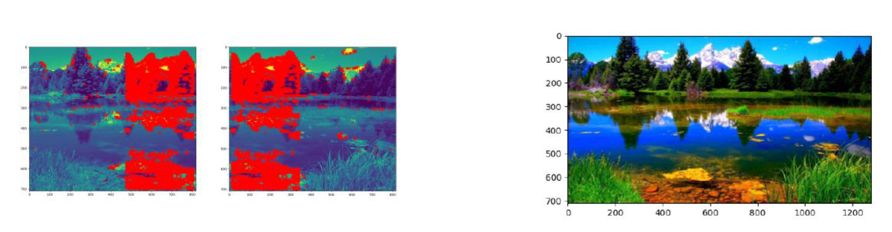

# Image Stitching Project
## Introduction

This project focuses on creating a panorama by stitching image pairs together using homography. The implementation process includes feature detection, feature matching and description, homography recovery and image stitching. The implementation is done from scratch, with only basic OpenCV functions.

## Implementation
1. **Feature Detection**: FAST corner detection method to detect keypoints in each image.  
2. **Feature Matching and Description**: BRIEF algorithm to compute descriptors at each keypoint and match between images based on the hamming distance.
3. **Homography Recovery**: Use RANSAC to estimate the projective transform.  
4. **Image Stitching**: Map pixels to destination image coordinates and blend them together to smooth seams.

## Project Structure
* `main.py` : Main file containing the image stitching pipeline.
* `fast.py` : Implements the FAST algorithm for detecting keypoints.  
* `brief.py` : Implements the BRIEF algorithm for describing keypoints and match the keypoints using hamming distance.  
* `orb.py` : Combines the FAST algorithm and BRIEF descriptor
* `homography.py`: Implements RANSAC algorithm to estimate the homography for aligning images
* `image_warpping.py`: Performs image warping and blending  
* `visualization.py` : Performs image visualization for the final result 
* `image_pairs/` : Folder containing sample image pairs 

## Results
Below is the sample result for the image stitching. The left image shows the detected keypoints pairs and the right image shows the final stitching image.

